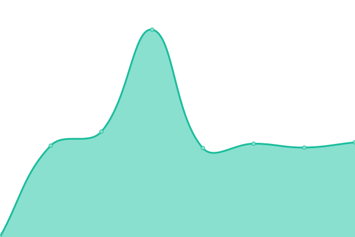
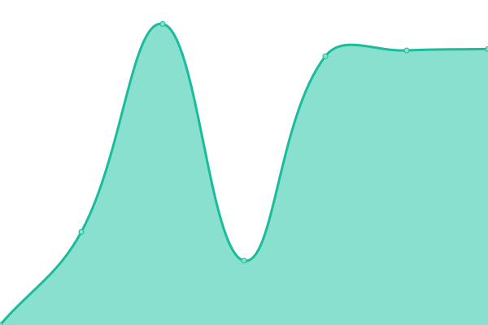
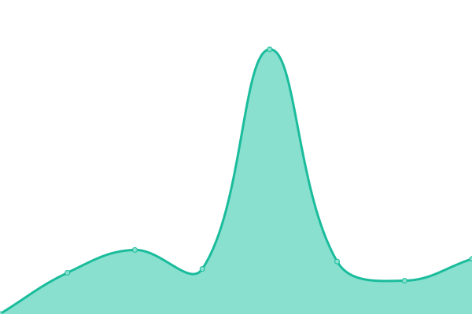
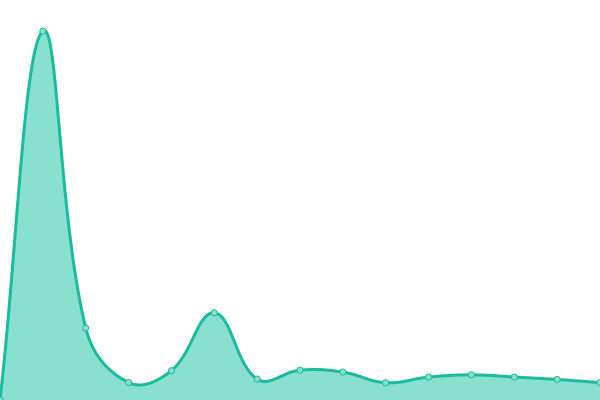

# [📈 Live Status](https://demo.upptime.js.org): <!--live status--> **🟧 Partial outage**

This repository contains the open-source uptime monitor and status page for [Joaquin Serra](https://demo.upptime.js.org), powered by [Upptime](https://github.com/upptime/upptime).

With [Upptime](https://upptime.js.org), you can get your own unlimited and free uptime monitor and status page, powered entirely by a GitHub repository. We use [Issues](https://github.com/joacoserra/statusPage/issues) as incident reports, [Actions](https://github.com/joacoserra/statusPage/actions) as uptime monitors, and [Pages](https://demo.upptime.js.org) for the status page.

<!--start: status pages-->
<!-- This summary is generated by Upptime (https://github.com/upptime/upptime) -->
<!-- Do not edit this manually, your changes will be overwritten -->
<!-- prettier-ignore -->
| URL | Status | History | Response Time | Uptime |
| --- | ------ | ------- | ------------- | ------ |
|  [Google](https://www.google.com) | 🟩 Up | [google.yml](https://github.com/joacoserra/statusPage/commits/HEAD/history/google.yml) | 

 103ms
     
 | 

<a href="https://joacoserra.github.io/statusPage/history/google">100.00%</a>
    

|  [Baipro S.A](https://baiproingenieria.com/) | 🟩 Up | [baipro-s-a.yml](https://github.com/joacoserra/statusPage/commits/HEAD/history/baipro-s-a.yml) | 

 711ms
     
 | 

<a href="https://joacoserra.github.io/statusPage/history/baipro-s-a">100.00%</a>
    

|  [Grupo Baipro](https://grupobaipro.com/) | 🟥 Down | [grupo-baipro.yml](https://github.com/joacoserra/statusPage/commits/HEAD/history/grupo-baipro.yml) | 

 1340ms
     
 | 

<a href="https://joacoserra.github.io/statusPage/history/grupo-baipro">0.00%</a>
    

|  [Neocomplexx](https://www.neocomplexx.com/) | 🟩 Up | [neocomplexx.yml](https://github.com/joacoserra/statusPage/commits/HEAD/history/neocomplexx.yml) | 

 1911ms
     
 | 

<a href="https://joacoserra.github.io/statusPage/history/neocomplexx">100.00%</a>
    

|  [eWins](https://www.ewins.com.ar/) | 🟩 Up | [e-wins.yml](https://github.com/joacoserra/statusPage/commits/HEAD/history/e-wins.yml) | 

 2637ms
     
 | 

<a href="https://joacoserra.github.io/statusPage/history/e-wins">100.00%</a>
    

|  [Sysacad UTN](http://www.frbb.utn.edu.ar/sysacad/LoginAlumno.asp) | 🟩 Up | [sysacad-utn.yml](https://github.com/joacoserra/statusPage/commits/HEAD/history/sysacad-utn.yml) | 

 990ms
     
 | 

<a href="https://joacoserra.github.io/statusPage/history/sysacad-utn">100.00%</a>
    

|  [UTN Aula Virtual](https://aulavirtual.frbb.utn.edu.ar/) | 🟥 Down | [utn-aula-virtual.yml](https://github.com/joacoserra/statusPage/commits/HEAD/history/utn-aula-virtual.yml) | 

 1333ms
     
 | 

<a href="https://joacoserra.github.io/statusPage/history/utn-aula-virtual">97.42%</a>
    

<!--end: status pages-->

[**Visit our status website →**](https://demo.upptime.js.org)

## 📄 License

- Powered by: [Upptime](https://github.com/upptime/upptime)
- Code: [MIT](./LICENSE) © [Joaquin Serra](https://demo.upptime.js.org)
- Data in the `./history` directory: [Open Database License](https://opendatacommons.org/licenses/odbl/1-0/)
